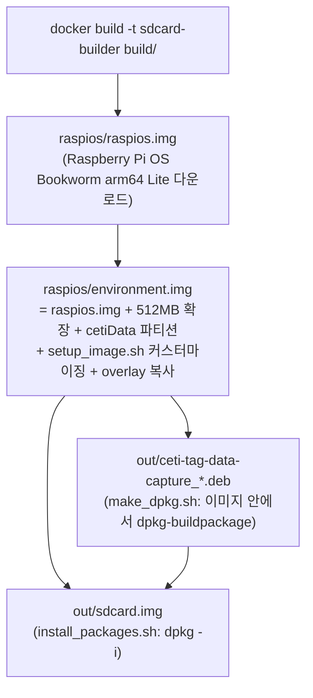

# 02. 빌드 시스템과 SD 카드 이미지

## 1. 전체 파이프라인

`make build` 한 번으로 SD 카드 이미지(`out/sdcard.img`)까지 만들어집니다. 빌드는 4단계
`.img` 산출물 체인이며, 각 단계는 ARM 이미지를 **loopback 마운트 + chroot + qemu-user-static**
으로 "타깃 안에서 네이티브처럼" 명령을 실행합니다. 전체가 Debian Bookworm **Docker 컨테이너**
안에서 돕니다 (`--privileged` 필요 — losetup/mount/chroot 때문).



핵심 파일별 역할:

| 파일 | 역할 |
|---|---|
| `Makefile` | 단계 오케스트레이션. `TARGET` 변수로 하위 단계만 실행 가능 |
| `build/Dockerfile` | `debian:bookworm` + qemu/binfmt/debhelper 등 빌드 도구 설치 |
| `build/rpi-image` | Python 단일 파일 도구: 공식 이미지 다운로드(SHA-256 검증), 파티션 확장/추가, 마운트, chroot 실행 (`disable_ld_preload()`로 chroot 중 `/etc/ld.so.preload` 임시 해제) |
| `build/setup_image.sh` | OS 커스터마이징 (아래 3절) — chroot 내부에서 실행 |
| `build/make_dpkg.sh` | `dpkg-buildpackage -b -us -uc -tc` (테스트는 `DEB_BUILD_OPTIONS=nocheck`로 생략) |
| `build/install_packages.sh` | .deb 설치. SHA-256 비교로 멱등(같으면 스킵, 다르면 purge 후 재설치) |

git 서브모듈 2개(`tests/lib/Unity`, `lib/libCetiRecovery`)는 빌드 시작 시
`git submodule update --init --recursive`로 자동 체크아웃됩니다.

주요 make 타깃:

- `make build` — 전체 (sdcard.img까지)
- `make packages` — .deb만
- `make test` — 단위 테스트 (호스트에서 직접 실행, Docker 미사용)
- `make lint` / `lint_fix` — super-linter v7.1.0
- `make deep_clean` — raspios/, out/, Docker 이미지까지 제거

CI(GitHub Actions)는 **린트와 단위 테스트만** 수행하며, 이미지 빌드 자체는 CI에서 검증되지
않습니다 (`.github/workflows/linter.yml`, `code_unit_tests.yml`).

## 2. 파티션 구성

`environment.img` 생성 시:

| 파티션 | 라벨 | 내용 |
|---|---|---|
| p1 | bootfs | 부트 (config.txt, cmdline.txt) |
| p2 | rootfs | 루트 (+512MB 확장) — 최종적으로 overlayroot(tmpfs)로 **읽기 전용** 운용 |
| p3 | **cetiData** | 128MB ext4로 생성 → **첫 부팅 시 SD 카드 나머지 전체로 확장** → `/data` 마운트 |

fstab: `/dev/disk/by-label/cetiData /data ext4 defaults,nofail 0 0`

## 3. `setup_image.sh` — OS 커스터마이징 요점

chroot된 ARM 이미지 안에서 실행되며, 태그 운용에 맞게 OS를 바꿉니다.

**커널/부트 설정** (`/boot/cmdline.txt`, `/boot/config.txt`):

- `isolcpus=2,3` — CPU 2,3 격리 (ECG/오디오 실시간 스레드 전용)
- `overlayroot=tmpfs:recurse=0` — 루트 읽기 전용화
- `console=serial0,115200` 제거 + `dtoverlay=miniuart-bt` — **UART를 회수 보드용으로 확보**
  (PL011은 STM32 플래싱에 사용)
- I2C 활성 + 400kHz, HDMI/스플래시 비활성

**계정/네트워크**:

- 계정 `pi`, 비밀번호 `ceticeti` (이미지에 하드코딩)
- Wi-Fi: NetworkManager 비활성, `dhcpcd` 사용. `wpa_supplicant-wlan0.conf`에
  SSID `CETI` / PSK `Talk2Whales` 하드코딩, 국가 US
- 타임존 `America/Dominica` (도미니카 — 향유고래 필드 사이트)

**전력·안정성 목적 비활성화**: apt 타이머, cron, logrotate, man-db, bluetooth,
ModemManager, triggerhappy, fake-hwclock 등.

**로그 재배치**: rsyslog 출력 경로를 `/var/log/*` → `/data/*.log`로 치환 (루트가 tmpfs라
로그가 휘발되지 않도록), journald → syslog 포워딩 활성.

**기타**: `/data` 생성(0777), stm32flash 소스 빌드/설치, `pi` 계정 `.bash_history`에 운영
치트시트 명령 54줄 시딩, PATH에 `/opt/ceti-tag-data-capture/bin:ipc` 추가(sudoers
secure_path 포함).

## 4. `overlay/` 와 첫 부팅 (`firstboot`)

`overlay/` 트리는 tar 파이프로 루트에 그대로 복사됩니다(소유자 `pi`).

`overlay/usr/lib/raspberrypi-sys-mods/firstboot`(교체본)가 **첫 부팅에 1회** 실행되어:

1. `cetiData` 파티션을 SD 카드 끝까지 **확장** (rootfs가 아니라 데이터 파티션을 확장!)
2. 호스트명 설정: `wt-` + `/proc/cpuinfo` 시리얼 뒤 8자리 (예: `wt-1a2b3c4d`)
   — 여러 태그가 같은 네트워크에 있어도 충돌하지 않고, 수집 데이터의 출처 식별에 사용
3. SSH 호스트 키 재생성, I2C/SPI/HW-serial 활성화 (raspi-config nonint)
4. `/data/swap/swapfile` **1GB 스왑** 생성 (`vm.swappiness=1`) — 오디오 공유 메모리가
   ~82MB×2라 512MB RAM 보드에서 필요
5. RTC 트리클 차지 활성화 (`i2cset -y 1 0x68 0x09 0xAA`)
6. cmdline에서 자신을 제거하고 `overlayroot=tmpfs` 확정 → 재부팅

`overlay/etc/bash.bashrc`는 프롬프트에 루트 파일시스템의 ro/rw 상태를 표시하고,
`ro`/`rw` 알리아스로 `/`와 `/boot`를 재마운트할 수 있게 합니다 (읽기 전용 루트 운용 편의).

## 5. Debian 패키지 (`debian/`)

- `control`: 패키지 `ceti-tag-data-capture`, `Architecture: arm64`, `Depends: pigpio`
- `rules`: `dh` 표준 + `override_dh_auto_install`에서 upstream Makefile의 `install` 호출.
  결과적으로 소스 트리의 상대경로 `opt/ceti-tag-data-capture/`에 설치물을 만들고
  `.install` 파일(`opt /`)이 패키지 루트로 쓸어 담는 구조
- `postinst`: 명령 FIFO 2개 생성
  - `/opt/ceti-tag-data-capture/ipc/cetiCommand` (mode 622 — 누구나 쓰기 가능)
  - `/opt/ceti-tag-data-capture/ipc/cetiResponse` (mode 644)
- `ceti-tag-data-capture.service` (systemd, dh_systemd_enable로 자동 활성):

```ini
[Unit]
Description=Captures data from input sensors of the Whale Tag ...
After=local-fs.target

[Service]
Type=simple
WorkingDirectory=/opt/ceti-tag-data-capture/ipc
ExecStartPre=systemctl restart rsyslog
ExecStart=/opt/ceti-tag-data-capture/bin/cetiTagApp
Restart=always
RestartSec=60
```

`Restart=always` + 60초 백오프로, 크래시든 정상 종료든 **무조건 재시작**됩니다. 앱의
자체 전원 차단 경로(SHUTDOWN 상태 → `reboot(POWER_OFF)`)와 결합되어 "죽지 않는 데몬"으로
설계되어 있습니다.

## 6. 타깃 파일시스템 최종 배치

```
/opt/ceti-tag-data-capture/
├── bin/cetiTagApp        # 메인 데몬
├── bin/cetiHWTest        # 하드웨어 수락 테스트
├── config/ceti-config.txt, tag-info.yaml, top.bin
├── ipc/  (FIFO 2개 + 운영 스크립트들)
/lib/systemd/system/ceti-tag-data-capture.service
/data/                    # cetiData 파티션 (모든 수집 데이터, 로그, 스왑, 설정 오버라이드)
```

## 7. C 애플리케이션 빌드 (`packages/ceti-tag-data-capture/Makefile`)

- 순수 GNU Make + gcc. `src/*/` 디렉터리 이름으로 앱 자동 탐색 → `cetiTagApp`, `cetiHWTest`
- `CFLAGS = -Wall -O2 -Wdate-time -D_FORTIFY_SOURCE=2 -D_GNU_SOURCE -I lib/libCetiRecovery`
- `LDFLAGS = -lpthread -lpigpio -lFLAC -lm -lrt`
  - **ALSA를 쓰지 않습니다.** 오디오는 FPGA→SPI(pigpio)로 직접 받아 libFLAC으로 인코딩
- `make debug` — `-g -DDEBUG` (UART 프레임 hex 덤프 등 디버그 로그 활성)
- `make reinstall` — 필드 업데이트용: 읽기 전용 루트(`/media/root-ro`)를 잠깐 rw로 열어
  bin/ipc만 복사

## 8. 재현/보안 관점 메모

- Wi-Fi PSK와 `pi` 비밀번호가 이미지에 평문 하드코딩되어 있습니다 (필드 전용 폐쇄망 가정).
- `.deb`의 `Depends`에 libFLAC가 빠져 있으나, `setup_image.sh`가 이미지에 flac을 설치하므로
  실제로는 동작합니다. 이미지 외 환경에 .deb만 설치하면 라이브러리 누락이 날 수 있습니다.
- 기타 빌드 관련 자잘한 이슈는 [07-testing-and-known-issues.md](07-testing-and-known-issues.md) 참조.
