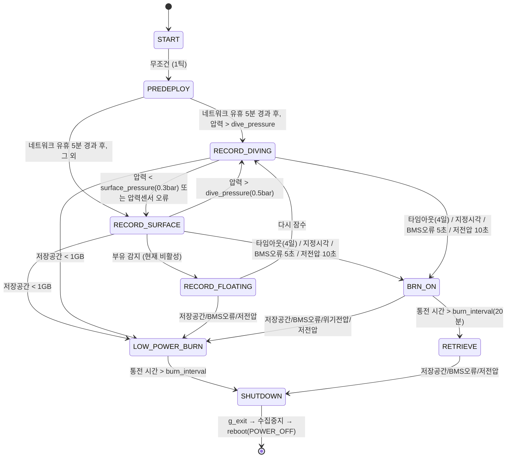

# 04. 미션 상태 머신과 번와이어 방출

소스: `src/cetiTagApp/state_machine.c` / `.h`. 메인 스레드에서 **1초 주기**로 실행됩니다.
`mission pause` 명령으로 일시정지하면 틱 자체가 완전히 멈춥니다(로깅 포함).

## 1. 상태 목록

| # | 상태 | 로그 문자열 | 의미 |
|---|---|---|---|
| 0 | `ST_START` | START | 부팅/초기화 (1틱 후 즉시 PREDEPLOY로) |
| 1 | `ST_PREDEPLOY` | PREDEPLOYMENT | 네트워킹 유지, 운영자 접속 대기 |
| 2 | `ST_RECORD_DIVING` | RECORD_DIVING | 잠수 중 기록 (무선·GPS 슬립) |
| 3 | `ST_RECORD_FLOATING` | RECORD_FLOATING | 고래에서 분리되어 떠 있는 것으로 추정 (현재 도달 불가 — 아래 참조) |
| 4 | `ST_RECORD_SURFACE` | RECORD_SURFACE | 수면 기록 (GPS 수집만, 송신 안 함) |
| 5 | `ST_BRN_ON` | BRN_ON | 번와이어 통전, 센서는 계속 수집 |
| 6 | `ST_LOW_POWER_BURN` | LOW_POWER_BURN | 번와이어 통전 + 센서 수집 중지 (전력 위기 시) |
| 7 | `ST_RETRIEVE` | RETRIEVE | 방출 완료, 비컨 켜고 회수 대기 |
| 8 | `ST_SHUTDOWN` | SHUTDOWN | 수집 종료 → 프로세스 종료 → 시스템 전원 차단 |

## 2. 상태 전이 다이어그램

## 3. 판정 조건 상세 (실제 코드 상수)

| 판정 | 조건 | 상수/기본값 |
|---|---|---|
| 잠수(`__at_depth`) | `pressure_bar > dive_pressure` | 0.5 bar (~5m) |
| 수면(`__at_surface`) | `pressure_bar < surface_pressure` **또는 압력 센서 오류** | 0.3 bar. 센서 고장은 "수면"으로 간주 (안전측: GPS 수집 상태로) |
| 네트워크 타임아웃 | 마지막 SSH 세션/충전 감지로부터 5분 경과 | `WIFI_GRACE_PERIOD_MIN 5` — PREDEPLOY를 벗어나기 전 이 시간 동안은 절대 전이하지 않음 |
| 충전 중(`__is_charging`) | `current_mA > 0` (배터리 SHM 없거나 오류면 true=충전 취급, Wi-Fi 유지) | fail-open 설계 |
| 저전압 | 어느 한 셀 전압 < `release_voltage/2`가 **연속 10초** | 카운터 10, 정상값 1번이면 리셋 |
| 위기전압 | 동일하게 `critical_voltage/2` 기준 연속 10초 | 카운터 10 |
| BMS 오류 | 배터리 샘플 오류 **연속 5초** | `MISSION_BMS_CONSECUTIVE_ERROR_THRESHOLD 5` |
| 저장공간 부족 | `/data` 여유 < 1GB (`statvfs`) | `LOW_MEMORY_THRESHOLD_GB 1` |
| 부유 감지(`__is_floating`) | IMU 피치 -85°±10° 자세 20분 유지 | **`FLOAT_DETECTION 0`으로 컴파일 시 비활성** (항상 false). 관련 코드에 버그도 있음 — 07 문서 |

전이 검사 순서는 위 표의 나열 순서대로이며 **첫 매치가 승리**합니다(저장공간 → 타임아웃 →
지정시각 → BMS → 전압 → 압력 순).

## 4. 상태 진입 시 부수 효과 (`stateMachine_set_state`)

상태가 바뀌는 순간 한 번 실행되는 동작들:

| 진입 상태 | 수집 스레드 | 회수 보드 | 네트워킹 | LED |
|---|---|---|---|---|
| START | 시작 | wake + `"CETI <호스트명> ready!"` 송신 | 유지 | FPGA 제어 |
| PREDEPLOY | 시작 | wake | 유지 | FPGA 제어 |
| RECORD_DIVING | 시작 | **sleep** (GPS/무선 정지) | **차단**¹ | 10초에 1번 녹색 점멸 |
| RECORD_SURFACE | 시작 | **gps_only** (수집만, 송신 금지)² | 차단¹ | FPGA 제어 |
| RECORD_FLOATING | 시작 | wake (송신 시작) | 차단¹ | FPGA 제어 |
| BRN_ON | 시작 | wake | 차단¹ | 적→황→녹 4Hz 회전 |
| LOW_POWER_BURN | **중지** | wake | 차단¹ | 전체 소등 |
| RETRIEVE | 시작 | wake | 차단¹ | 10초에 1번 녹색 |
| SHUTDOWN | 중지 | wake | 차단¹ | 소등, `g_exit=1` |

¹ 단, SSH 세션이 활성 중이면 접속을 끊지 않기 위해 네트워킹을 끄지 않습니다.
² "고래에 붙어 있는 동안은 송신하지 않는다"는 원칙 (`rec_tx_on_whale` 설정으로 예외 가능).

## 5. 번와이어(burnwire) 동작

하드웨어: I/O 익스팬더(I2C 0x21) **핀 4** 하나로 ON/OFF (`burnwire.c`).

### 타임아웃 기준 시각의 결정 (재부팅 내성)

배포 타임아웃(기본 4일)의 "시작 시각"은 4가지 출처(`BSS_NONE/FILE/RTC/NTP`) 중에서
정해집니다:

1. **START 진입 시**: 현재 시각으로 초기화 (NTP 동기화됐으면 NTP, 아니면 RTC 신뢰도)
2. `/data/burnwire_timeout_start_time_s.csv` 파일이 존재하면 그 값으로 **덮어씀** —
   배포 중 예기치 못한 재부팅이 나도 타임아웃이 리셋되지 않게 하는 장치
3. 매 틱: 아직 NTP 동기화 전이고 네트워크가 살아 있으면 재시도, 성공 시 RTC 기준이던
   시작 시각을 NTP 기준으로 승격
4. **첫 잠수(RECORD_DIVING 진입) 시**: "진짜 배포가 확인됐으니" 시작 시각을 지금으로
   다시 찍고 위 파일로 영속화하는 것이 **의도**
   (⚠ 현재 코드는 조건이 반전되어 있어 새 배포에서 이 단계가 동작하지 않습니다 —
   [07 문서](07-testing-and-known-issues.md#1-번와이어-타임아웃-영속화-조건-반전) 참조)

### 통전과 종료

- BRN_ON 또는 LOW_POWER_BURN 진입 시 `burnwireOn()` + 통전 시작 시각 기록 + 영속화 파일
  삭제. 내부 플래그로 중복 통전을 막으므로 BRN_ON→LOW_POWER_BURN 전이가 일어나도
  통전은 끊기지 않고 **총 통전 시간은 `burn_interval` 1회분**입니다.
- `burn_interval`(배포 설정 20분) 경과 → BRN_ON이면 RETRIEVE, LOW_POWER_BURN이면
  SHUTDOWN으로 가며, 다음 상태 진입 시 `burnwireOff()`.

### 방출 트리거 총정리

1. 배포 타임아웃 (기본 4일, `timeout_release`)
2. 지정 시각 방출 (`time_of_day_release`, UTC, 설정 시)
3. BMS 오류 연속 5초
4. 저전압 (셀당 3.3V, 연속 10초)
5. 저장공간 < 1GB → 곧장 LOW_POWER_BURN
6. 수동: `sendCommand burnwire on` 또는 `sendCommand mission setState BRN_ON`

## 6. 상태 로그

틱마다 `/data/data_state.csv`에 `Timestamp, RTC, Notes, 처리한 상태, 다음 상태`가
기록됩니다 (`stopLogging` 중에는 생략). 사후 분석 시 미션 타임라인 복원의 기준 파일입니다.

## 7. `tmp/state_machine.{c,h}` 에 대하여

저장소 루트의 `tmp/`에는 상태 머신의 **오래된 작업 사본**이 커밋되어 있습니다
(PREDEPLOY 상태가 없고, FLOAT_DETECTION이 켜져 있는 등 구버전). 빌드에는 포함되지 않는
잔재물이지만, 흥미롭게도 위 5절의 "조건 반전" 버그가 이 구버전에는 없습니다
(즉, 리팩터링 과정에서 회귀한 것으로 보임).
