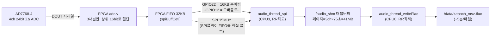

# 05. 센서와 데이터 수집

## 1. 버스/핀 지도

### I2C 주소 지도

| 장치 | 칩 | 버스 | 주소 |
|---|---|---|---|
| ECG ADC | TI ADS1219 | **0** | 0x44 (버스 0의 유일한 장치) |
| I/O 익스팬더 | PCAL6408/9538 계열 | 1 | 0x21 |
| 조도 | LiteON LTR-329ALS-01 | 1 | 0x29 |
| 배터리 게이지 | Maxim MAX17320 | 1 | 0x36 (레지스터 ≤0xFF) / 0x0B (>0xFF) |
| 압력/수온 | Keller 4LD | 1 | 0x40 |
| RTC | (DS1307계) | 1 | 0x68 |
| IMU | CEVA BNO086 | **비트뱅** GPIO23/24 @200kHz | 0x4A |

### 주요 Raspberry Pi GPIO (BCM)

| 핀 | 용도 |
|---|---|
| 4 | IMU 리셋 (FPGA 경유) |
| 5 | FPGA CAM 리셋 |
| 6 | ECG ADC DRDY (FPGA 통과) |
| 8/9/10/11 | SPI0 — 오디오 스트림 (CE0/MISO/MOSI/SCLK) |
| 12 | 오디오 FIFO **오버플로** 래치 (FPGA→Pi) |
| 14/15 | UART — 회수 보드 |
| 16/18/19 | FPGA CAM 제어 링크 (SCK/DOUT/DIN, 비트뱅) |
| 20/21/25/26/27 | FPGA slave-serial 컨피그 (DATA/CLK/INIT_B/PROG_B/DONE) |
| 22 | 오디오 **데이터 준비**(FIFO 하이워터마크) (FPGA→Pi) |
| 23/24 | IMU 비트뱅 I2C |

### I/O 익스팬더 핀 (0x21)

| 비트 | 용도 |
|---|---|
| 0 | 5V 인에이블 (오디오 프런트엔드) |
| 1 | 회수 보드 STM32 BOOT0 |
| 2 | 3V3 RF 인에이블 (회수 보드 전원) |
| 4 | **번와이어 ON** |
| 6/7 | ECG 리드오프 검출 N/P |

## 2. 오디오 파이프라인 (하이라이트)

이 시스템의 꽃입니다. 경로: **AD7768-4 ADC → FPGA FIFO → SPI → 공유 메모리 → FLAC 파일**.

- **FPGA (`FPGA_v2p1/rtl/`)**: `adc.v`가 AD7768의 채널당 32bit 프레임에서 8bit 헤더를
  제거하고 하위 8bit를 버려 **채널 0·1·2만 16bit**로 FIFO에 직렬화합니다(4번 채널은 대역폭
  때문에 의도적으로 폐기). FIFO 읽기 클럭이 **Pi의 SPI SCLK 그 자체**라서 MOSI 프로토콜이
  없습니다 — Pi가 클럭을 치면 데이터가 나오는 구조.
- **흐름 제어**: FIFO에 16KB(하이워터마크 512×32B) 쌓이면 GPIO22가 올라가고, Pi가 16KB
  블록 하나를 `spiRead`합니다 (96kHz/16bit 기준 블록당 ~28.4ms). FIFO가 넘치면 GPIO12가
  래치되고 Pi가 수집을 리셋·재시작하는 복구 루틴(`__handle_overflow`)이 돕니다.
- **ADC 설정은 CAM 링크로**: FPGA의 `cam.v`가 8바이트 고정 프레임
  `[0x02][opcode][arg1][arg0][pay1][pay0][cs][0x03]`의 비트뱅 브리지를 제공하며, 이걸로
  ADC 레지스터 쓰기/읽기, FIFO 리셋/시작/정지, I2C 브리지, LED 제어, 시스템 전원 차단
  (BMS 레지스터 쓰기)까지 수행합니다. FPGA 버전 조회 opcode도 있습니다(현재 0x23.0x01).
- **샘플레이트**: 48/96/192kHz(+저전력 750Hz)를 ADC 데시메이션/클럭 분주 조합으로 설정.
  기본 96kHz/16bit/wideband. `ENABLE_RUNTIME_AUDIO 0`이라 런타임 강제값도 96kHz/16bit.
- **FLAC 기록**: 페이지(약 75초)가 차면 페이지를 통째로 libFLAC 인코더에 넣습니다.
  파일은 약 5분(4페이지)마다 로테이션, 이름은 기록 시작 시각 `<epoch_ms>.flac`, 3채널.
  `ENABLE_AUDIO_FLAC 0`으로 빌드하면 빅엔디언 raw PCM(`.raw`)을 씁니다.
- **메모리 비용**: 공유 메모리 더블버퍼 ~82.4MiB + FLAC 변환용 정적 버퍼 ~82.4MiB
  ≈ **165MiB** — 512MB 보드에서 1GB 스왑을 만드는 이유입니다.
- 오버플로/기록 타이밍 이벤트는 `/data/data_audio_status.csv`에 남습니다.

## 3. ECG (`sensors/ecg.c`, `ecg_helpers/`)

- **칩**: ADS1219 24bit ΣΔ ADC, I2C 버스 0 (0x44), 외부 Vref, 게인 1, **1000 SPS** 연속
  변환, 단일엔드 ch0.
- 수집 스레드는 CPU 2(격리 코어)에서 DRDY(GPIO6)를 **sleep 없이 바쁜 대기**합니다 —
  주석에 따르면 sleep을 넣으면 스펙트로그램에 아티팩트가 생겨 의도적으로 코어 하나(~85%)를
  태우는 선택.
- **리드오프(전극 분리) 검출**: 전용 칩이 아니라 I/O 익스팬더 핀 6/7을 1ms 주기 백그라운드
  스레드가 캐싱해 샘플마다 붙입니다.
- 견고성: 연속 0값 100개(보드 분리 추정), 샘플 타임아웃 100ms, I2C 오류 시 노트 플래그를
  남기고 1초 쉰 뒤 ADC 전체 재초기화.
- **파일**: `/data/data_ecg_NN.csv` (1GiB마다 로테이션, 약 6.5시간분). 열:
  `Timestamp [us], RTC Count, Notes, Sample Index, ECG, Leads-Off-P, Leads-Off-N`

## 4. IMU (`sensors/imu.c`, `device/bno086.c`, `log/imu_log.c`)

- **칩**: BNO086 (SHTP 프로토콜), pigpio 비트뱅 I2C(GPIO23/24, 200kHz, 주소 0x4A).
  리셋 후 500ms 대기(짧으면 첫 피처 리포트 실패).
- 활성 리포트: 회전 벡터(쿼터니언) **20Hz**, 가속도/자이로/지자기 **50Hz**.
- 수집 스레드가 20ms 주기로 SHTP 리포트를 파싱해 2페이지 링버퍼(페이지=2초 분량,
  340리포트)에 넣고, 로깅 스레드가 1초마다 4개의 CSV로 분리 기록:
  `/data/data_imu_quat_NN.csv`, `_accel_`, `_gyro_`, `_mag_` (각 1GiB 로테이션).
- 값은 **스케일링 전 Q-포인트 원시 정수**로 기록됩니다(쿼터니언은 Q14). 타임스탬프는
  센서 내부 지연을 보정한 `Capture_Timestamp_us`와 읽은 시각을 함께 기록.
- 상태 머신의 자세 판정(부유 감지)용으로 최신 쿼터니언→오일러 변환 API 제공.

## 5. 압력/수온 (`sensors/pressure_temperature.c`, `device/keller4ld.c`)

- Keller 4LD (200bar 레인지), I2C 0x40. 측정 요청(0xAC) → 8ms 대기 → 5바이트 읽기.
- 변환: `P[bar] = (200/32768)·(raw−16384)`, `T[°C] = ((raw>>4)−24)·0.05−50`
- **1Hz** 샘플링, 실패 시 지수 백오프. `/data/data_pressure_temperature.csv`
  (`Pressure [bar], Water Temperature [C]`).
- 이 값이 상태 머신의 잠수/수면 판정 입력입니다.

## 6. 조도 (`sensors/light.c`, `device/ltr329als.c`)

- LTR-329ALS-01, I2C 0x29. 가시광 채널 + 적외선 채널, **1Hz**.
- `/data/data_light.csv` (`Ambient Light: Visible, Ambient Light: IR`).
- 부착/이탈·주야 판단 보조용. 측정 주기 레지스터는 기본값(파워온 디폴트)으로 동작.

## 7. 배터리/BMS (`battery.c`, `device/max17320.c`)

- MAX17320 2셀 게이지+보호 IC. R_sense 10mΩ, 설계 용량 5000mAh.
- **1Hz**로 셀1/2 전압, 전류, 셀1/2 온도, SoC, STATUS/PROTALRT 플래그를 읽어
  `/data/data_battery.csv`에 기록 (플래그는 사람이 읽을 수 있는 문자열로 디코딩).
- 소프트웨어 보호: 충전 허용 온도 범위 밖이면 충전 FET 차단, 방전 고온이면 방전 FET
  차단(래치, `battery reset` 명령으로 해제).
- 비휘발성(NV) 설정은 **쓰기 수명이 7회**뿐이라 부팅 시엔 섀도 RAM만 덮어쓰고,
  영구 프로그래밍은 별도 스크립트 `ipc/nvwrite.sh`로 수동 수행. `battery verify` 명령이
  기대값 테이블과 NV를 대조합니다.
- 태그 절전/기상: `ipc/tagSleep.sh`(FET 차단), `ipc/tagWake.sh`(FET 인에이블), 완전
  전원 차단은 FPGA를 통해(`powerdown` 명령 — Pi가 죽은 뒤 FPGA가 BMS를 꺼줌).

## 8. `/data`에 쌓이는 파일 총람

| 파일 | 내용 | 주기/회전 |
|---|---|---|
| `<epoch_ms>.flac` | 3ch 오디오 | ~5분/파일 |
| `data_audio_status.csv` | 오디오 오버플로/기록 이벤트 | 이벤트 |
| `data_ecg_NN.csv` | 1kHz ECG + 리드오프 | 1GiB 회전 |
| `data_imu_{quat,accel,gyro,mag}_NN.csv` | IMU 원시값 | 1GiB 회전 |
| `data_pressure_temperature.csv` | 압력/수온 | 1Hz |
| `data_light.csv` | 조도 | 1Hz |
| `data_battery.csv` | 배터리 | 1Hz |
| `data_gps.csv` | 원시 NMEA 문장 | 수신 시 |
| `data_state.csv` | 상태 머신 타임라인 | 1Hz |
| `data_systemMonitor.csv` | CPU/RAM/디스크/온도 | 10초 |
| `data_config_<ts>.txt` / `data_tag_info_<ts>.yaml` | 배포 설정/메타 스냅샷 | 시작 60초 후 1회 |
| `burnwire_timeout_start_time_s.csv` | 번와이어 타임아웃 기준 시각 (재부팅 내성) | 상태 이벤트 |
| `test_result_<ms>.txt` | cetiHWTest 결과 | 수동 |
| `*.log`, `logs/` | rsyslog 리다이렉트 | 상시 |

여유 공간이 1GB 밑으로 내려가면 상태 머신이 LOW_POWER_BURN으로 넘어가 기록을 멈춥니다.
