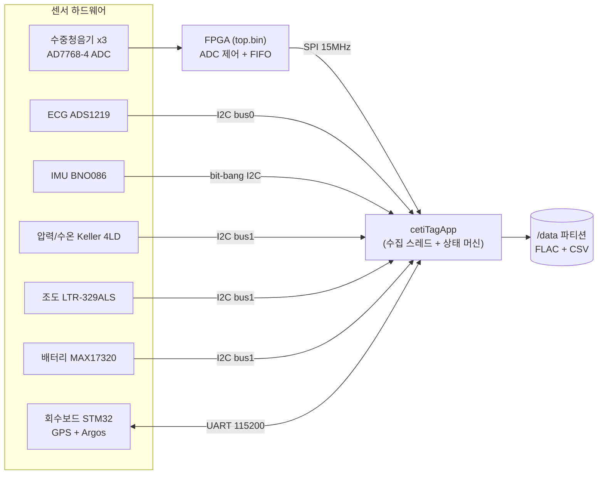

# Whale Tag Embedded — 역공학 분석 문서 (한국어)

> 🇬🇧 English version: [`docs/en/`](en/README.md)

이 디렉터리는 `whale-tag-embedded` 저장소 전체를 역공학(reverse engineering) 방식으로 분석하여
정리한 문서 모음입니다. 코드를 처음 접하는 개발자가 "이 시스템이 무엇이고, 어떻게 빌드되고,
실행 중에 무슨 일이 일어나는가"를 이해할 수 있도록 작성했습니다.

분석 기준 시점: `main` 브랜치 커밋 `1e3507a` (v2.5 병합, 2026년 1월), 애플리케이션 버전
`"State Machine Simplified - V2.5.1"` (`packages/ceti-tag-data-capture/src/cetiTagApp/_versioning.h`).

## 문서 목차

| 문서 | 내용 |
|---|---|
| [01-overview.md](01-overview.md) | 프로젝트 소개, 하드웨어 구성, 저장소 디렉터리 구조 |
| [02-build-and-image.md](02-build-and-image.md) | Docker/QEMU 기반 SD 카드 이미지 빌드 파이프라인, OS 커스터마이징, Debian 패키징, systemd 서비스 |
| [03-app-architecture.md](03-app-architecture.md) | 메인 애플리케이션(`cetiTagApp`) 구조 — 스레드 모델, 공유 메모리, 명령 IPC, 설정 파일 |
| [04-state-machine.md](04-state-machine.md) | 미션 상태 머신 — 상태·전이 조건·임계값, 번와이어(burnwire) 방출 로직 |
| [05-sensors-and-audio.md](05-sensors-and-audio.md) | 센서/데이터 수집 — FPGA 오디오 파이프라인, ECG, IMU, 압력, 조도, 배터리, 핀맵/버스맵, `/data` 산출물 |
| [06-recovery.md](06-recovery.md) | 회수(Recovery) 보드 — GPS/Argos/APRS 통신 프로토콜, 상태별 전원 제어, LED 표시 |
| [07-testing-and-known-issues.md](07-testing-and-known-issues.md) | 테스트 인프라, 하드웨어 테스트, 분석 중 발견한 의심 버그 목록 |

## 30초 요약

이 저장소는 **Project CETI**(향유고래 의사소통 연구 프로젝트)가 고래 몸에 부착하는
**데이터 수집 태그("Whale Tag")의 임베디드 소프트웨어 전체**입니다. 구체적으로:

1. **Raspberry Pi Zero 2 W** 기반 태그에 올라가는 **Raspberry Pi OS SD 카드 이미지**를
   Docker + QEMU로 재현 가능하게 빌드하는 빌드 시스템 (`Makefile`, `build/`, `overlay/`)
2. 태그의 핵심 데몬인 **`cetiTagApp`** — 수중청음기(hydrophone) 3채널 오디오, ECG, IMU,
   압력/수온, 조도, 배터리를 동시에 수집해 `/data` 파티션에 기록하고,
   **미션 상태 머신**으로 잠수/부상/방출/회수 수명주기를 자율 제어하는 C 프로그램
   (`packages/ceti-tag-data-capture/`)
3. 오디오 ADC(AD7768-4)를 구동하고 SPI로 Pi에 스트리밍하는 **FPGA 게이트웨어**(Verilog,
   `FPGA_v2p1/`)와, 태그가 고래에서 떨어져 나온 뒤 위치를 알리는 **STM32 회수 보드**
   (GPS + Argos 위성/APRS VHF)의 Pi 측 드라이버

태그는 부착 후 며칠간 데이터를 모으고, 설정된 시간 초과·저전압·저장공간 부족 등의 조건에서
**번와이어(부식 와이어)를 가열해 고래에서 스스로 분리**된 뒤, GPS 위치를 위성으로 송신하며
회수를 기다립니다.

## 데이터 흐름 한눈에 보기

## 이 문서를 읽는 순서

- 전체 그림이 궁금하면 → 01 → 03 → 04 순서로.
- 이미지를 빌드/설치하려면 → 02.
- 특정 센서 데이터 포맷이 궁금하면 → 05.
- 배포(deployment) 운영 관점이면 → 04(방출 조건) + 06(회수).
- 코드 수정 전이라면 → 07(알려진 이슈)을 먼저 읽는 것을 권합니다.
