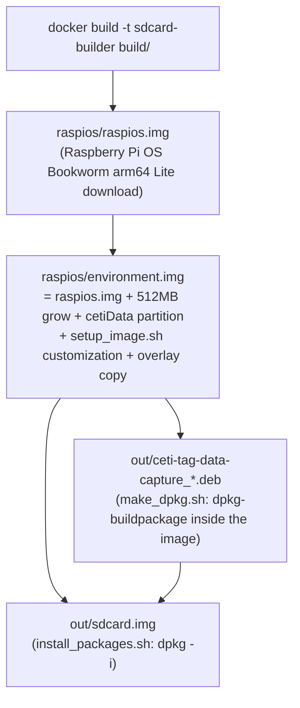

# 02. Build System and SD-Card Image

## 1. The pipeline

A single `make build` produces the SD-card image (`out/sdcard.img`). The build is a
4-stage chain of `.img` artifacts; each stage executes commands "natively" inside the ARM
image via **loopback mount + chroot + qemu-user-static**. Everything runs inside a Debian
Bookworm **Docker container** (`--privileged` is required for losetup/mount/chroot).



Role of each key file:

| File | Role |
|---|---|
| `Makefile` | Stage orchestration. The `TARGET` variable can run sub-stages in Docker |
| `build/Dockerfile` | `debian:bookworm` + qemu/binfmt/debhelper etc. |
| `build/rpi-image` | Single-file Python tool: official image download (SHA-256 verified), partition grow/append, mount, chroot execution (`disable_ld_preload()` temporarily removes `/etc/ld.so.preload` during chroot) |
| `build/setup_image.sh` | OS customization (section 3) — runs inside the chroot |
| `build/make_dpkg.sh` | `dpkg-buildpackage -b -us -uc -tc` (tests skipped via `DEB_BUILD_OPTIONS=nocheck`) |
| `build/install_packages.sh` | .deb install. Idempotent via SHA-256 comparison (skip if same, purge+reinstall if different) |

Two git submodules (`tests/lib/Unity`, `lib/libCetiRecovery`) are checked out
automatically at build start (`git submodule update --init --recursive`).

Main make targets:

- `make build` — everything (up to sdcard.img)
- `make packages` — .deb only
- `make test` — unit tests (run directly on the host, no Docker)
- `make lint` / `lint_fix` — super-linter v7.1.0
- `make deep_clean` — also removes raspios/, out/, and the Docker image

CI (GitHub Actions) runs **lint and unit tests only**; the image build itself is not
exercised in CI (`.github/workflows/linter.yml`, `code_unit_tests.yml`).

## 2. Partition layout

When creating `environment.img`:

| Partition | Label | Contents |
|---|---|---|
| p1 | bootfs | Boot (config.txt, cmdline.txt) |
| p2 | rootfs | Root (+512 MB grow) — ultimately run **read-only** via overlayroot (tmpfs) |
| p3 | **cetiData** | Created as 128 MB ext4 → **grown to fill the SD card at first boot** → mounted at `/data` |

fstab: `/dev/disk/by-label/cetiData /data ext4 defaults,nofail 0 0`

## 3. `setup_image.sh` — OS customization highlights

Runs inside the chrooted ARM image and adapts the OS for tag operation.

**Kernel/boot settings** (`/boot/cmdline.txt`, `/boot/config.txt`):

- `isolcpus=2,3` — isolate CPUs 2, 3 (dedicated to the real-time ECG/audio threads)
- `overlayroot=tmpfs:recurse=0` — read-only root
- remove `console=serial0,115200` + `dtoverlay=miniuart-bt` — **frees the UART for the
  recovery board** (the PL011 is used for STM32 flashing)
- I2C enabled at 400 kHz, HDMI/splash disabled

**Accounts/network**:

- User `pi`, password `ceticeti` (hardcoded into the image)
- Wi-Fi: NetworkManager disabled, `dhcpcd` used. `wpa_supplicant-wlan0.conf` hardcodes
  SSID `CETI` / PSK `Talk2Whales`, country US
- Timezone `America/Dominica` (Dominica — the sperm whale field site)

**Disabled for power/stability**: apt timers, cron, logrotate, man-db, bluetooth,
ModemManager, triggerhappy, fake-hwclock, etc.

**Log relocation**: rsyslog output paths rewritten from `/var/log/*` to `/data/*.log`
(so logs survive the tmpfs root), journald forwarding to syslog enabled.

**Misc**: `/data` created (0777), stm32flash built from source, the `pi` account's
`.bash_history` seeded with a 54-line operator cheat sheet, PATH extended with
`/opt/ceti-tag-data-capture/bin:ipc` (including sudoers secure_path).

## 4. `overlay/` and first boot (`firstboot`)

The `overlay/` tree is copied verbatim onto the root (owned by `pi`).

The replacement `overlay/usr/lib/raspberrypi-sys-mods/firstboot` runs **once at first
boot** and:

1. **Grows the `cetiData` partition** to the end of the SD card (the data partition, not
   the rootfs!)
2. Sets the hostname: `wt-` + last 8 chars of the `/proc/cpuinfo` serial (e.g.
   `wt-1a2b3c4d`) — avoids collisions when multiple tags share a network and identifies
   the data source in the ingestion pipeline
3. Regenerates SSH host keys, enables I2C/SPI/HW-serial (raspi-config nonint)
4. Creates a **1 GB swapfile** at `/data/swap/swapfile` (`vm.swappiness=1`) — needed
   because the audio shared memory is ~82 MB ×2 on a 512 MB board
5. Enables RTC trickle charge (`i2cset -y 1 0x68 0x09 0xAA`)
6. Removes itself from cmdline, finalizes `overlayroot=tmpfs` → reboot

`overlay/etc/bash.bashrc` shows the root filesystem's ro/rw state in the prompt and adds
`ro`/`rw` aliases to remount `/` and `/boot` (convenience for read-only root operation).

## 5. Debian package (`debian/`)

- `control`: package `ceti-tag-data-capture`, `Architecture: arm64`, `Depends: pigpio`
- `rules`: standard `dh` + `override_dh_auto_install` calling the upstream Makefile's
  `install`. The install lands in the source tree's relative `opt/ceti-tag-data-capture/`
  and the `.install` file (`opt /`) sweeps that whole tree into the package root
- `postinst`: creates the two command FIFOs
  - `/opt/ceti-tag-data-capture/ipc/cetiCommand` (mode 622 — world-writable)
  - `/opt/ceti-tag-data-capture/ipc/cetiResponse` (mode 644)
- `ceti-tag-data-capture.service` (systemd, auto-enabled via dh_systemd_enable):

```ini
[Unit]
Description=Captures data from input sensors of the Whale Tag ...
After=local-fs.target

[Service]
Type=simple
WorkingDirectory=/opt/ceti-tag-data-capture/ipc
ExecStartPre=systemctl restart rsyslog
ExecStart=/opt/ceti-tag-data-capture/bin/cetiTagApp
Restart=always
RestartSec=60
```

With `Restart=always` + 60 s backoff, the daemon is restarted **unconditionally**, whether
it crashed or exited cleanly. Combined with the app's own power-off path (SHUTDOWN state →
`reboot(POWER_OFF)`), it is designed as a daemon that never stays down.

## 6. Final target filesystem layout

```
/opt/ceti-tag-data-capture/
├── bin/cetiTagApp        # Main daemon
├── bin/cetiHWTest        # Hardware acceptance test
├── config/ceti-config.txt, tag-info.yaml, top.bin
├── ipc/  (2 FIFOs + operator scripts)
/lib/systemd/system/ceti-tag-data-capture.service
/data/                    # cetiData partition (all recorded data, logs, swap, config override)
```

## 7. C application build (`packages/ceti-tag-data-capture/Makefile`)

- Plain GNU Make + gcc. Apps auto-discovered from `src/*/` directory names →
  `cetiTagApp`, `cetiHWTest`
- `CFLAGS = -Wall -O2 -Wdate-time -D_FORTIFY_SOURCE=2 -D_GNU_SOURCE -I lib/libCetiRecovery`
- `LDFLAGS = -lpthread -lpigpio -lFLAC -lm -lrt`
  - **No ALSA.** Audio comes straight from the FPGA over SPI (pigpio) and is encoded with
    libFLAC
- `make debug` — `-g -DDEBUG` (enables debug logging such as UART frame hex dumps)
- `make reinstall` — field-update helper: briefly remounts the read-only root
  (`/media/root-ro`) rw and copies bin/ipc only

## 8. Reproducibility/security notes

- The Wi-Fi PSK and the `pi` password are hardcoded in plain text in the image (assumes a
  closed field network).
- The `.deb`'s `Depends` omits libFLAC, but `setup_image.sh` installs flac into the image,
  so it works in practice. Installing just the .deb elsewhere may hit a missing library.
- Other minor build issues are listed in
  [07-testing-and-known-issues.md](07-testing-and-known-issues.md).
