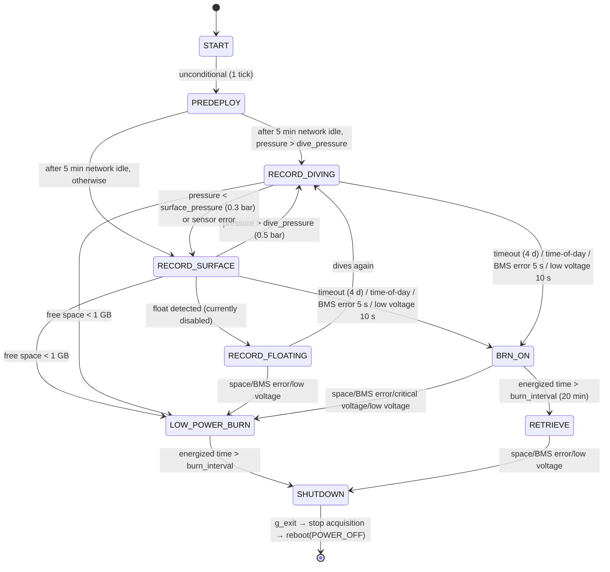

# 04. Mission State Machine and Burnwire Release

Sources: `src/cetiTagApp/state_machine.c` / `.h`. Runs on the main thread at a **1-second
tick**. `mission pause` stops the tick entirely (including logging).

## 1. States

| # | State | Log string | Meaning |
|---|---|---|---|
| 0 | `ST_START` | START | Boot/init (moves to PREDEPLOY after one tick) |
| 1 | `ST_PREDEPLOY` | PREDEPLOYMENT | Networking up, waiting for the operator |
| 2 | `ST_RECORD_DIVING` | RECORD_DIVING | Recording while submerged (radio/GPS asleep) |
| 3 | `ST_RECORD_FLOATING` | RECORD_FLOATING | Presumed detached and floating (enabled via `FLOAT_DETECTION 1`) |
| 4 | `ST_RECORD_SURFACE` | RECORD_SURFACE | Recording at the surface (GPS collection only, no TX) |
| 5 | `ST_BRN_ON` | BRN_ON | Burnwire energized, sensors still recording |
| 6 | `ST_LOW_POWER_BURN` | LOW_POWER_BURN | Burnwire energized + acquisition stopped (power crisis) |
| 7 | `ST_RETRIEVE` | RETRIEVE | Release complete, beaconing, awaiting pickup |
| 8 | `ST_SHUTDOWN` | SHUTDOWN | Stop acquisition → exit process → system power-off |

## 2. Transition diagram

## 3. Predicate details (actual code constants)

| Predicate | Condition | Constant/default |
|---|---|---|
| At depth (`__at_depth`) | `pressure_bar > dive_pressure` | 0.5 bar (~5 m) |
| At surface (`__at_surface`) | `pressure_bar < surface_pressure` **or pressure sensor error** | 0.3 bar. Sensor failure counts as "surfaced" (safe side: GPS-collection state) |
| Network timeout | 5 min since the last SSH session / charging detection | `WIFI_GRACE_PERIOD_MIN 5` — PREDEPLOY never transitions before this |
| Charging (`__is_charging`) | `current_mA > 0` (battery SHM missing or in error → treated as charging, keeps Wi-Fi up) | fail-open design |
| Low voltage | either cell < `release_voltage/2` for **10 consecutive seconds** | counter of 10, reset by one good reading |
| Critical voltage | same, against `critical_voltage/2`, 10 consecutive seconds | counter of 10 |
| BMS error | battery sample in error for **5 consecutive seconds** | `MISSION_BMS_CONSECUTIVE_ERROR_THRESHOLD 5` |
| Low storage | `/data` free < 1 GB (`statvfs`) | `LOW_MEMORY_THRESHOLD_GB 1` |
| Floating (`__is_floating`) | IMU pitch −85°±10° / roll 0°±10° attitude (10-sample moving average) held **continuously for 20 min**; evaluation deferred until the smoothing buffer refills (10 s after a reset) | **Enabled via `FLOAT_DETECTION 1`**. On detection: SURFACE→FLOATING (TX starts), RETRIEVE→SHUTDOWN (Pi powered down, beacon stays alive) |

Checks are evaluated in the order listed and **the first match wins** (space → timeout →
time-of-day → BMS → voltage → pressure).

## 4. Entry side effects (`stateMachine_set_state`)

Actions executed once, at the moment the state changes:

| Entered state | Acquisition | Recovery board | Networking | LEDs |
|---|---|---|---|---|
| START | start | wake + transmit `"CETI <hostname> ready!"` | keep | FPGA control |
| PREDEPLOY | start | wake | keep | FPGA control |
| RECORD_DIVING | start | **sleep** (GPS/radio idle) | **disabled**¹ | green blink every 10 s |
| RECORD_SURFACE | start | **gps_only** (collect only, no TX)² | disabled¹ | FPGA control |
| RECORD_FLOATING | start | wake (TX begins) | disabled¹ | FPGA control |
| BRN_ON | start | wake | disabled¹ | red→yellow→green 4 Hz chase |
| LOW_POWER_BURN | **stop** | wake | disabled¹ | all off |
| RETRIEVE | start | wake | disabled¹ | green every 10 s |
| SHUTDOWN | stop | wake | disabled¹ | off, `g_exit=1` |

¹ Unless an SSH session is active — a live debugging session is deliberately not dropped.
² The "never transmit while on the whale" rule (`rec_tx_on_whale` can override).

## 5. Burnwire operation

Hardware: a single I/O expander pin (I2C 0x21, **pin 4**) switches it on/off (`burnwire.c`).

### Determining the timeout start time (reboot resilience)

The "start time" for the deployment timeout (default 4 days) comes from one of four
sources (`BSS_NONE/FILE/RTC/NTP`):

1. **On entering START**: initialized to the current time (source NTP if synced, else RTC)
2. If `/data/burnwire_timeout_start_time_s.csv` exists, its value **overrides** the above
   — so an unexpected mid-deployment reboot does not reset the timeout
3. Every tick: while NTP is not yet synced and networking is up, retry; on success the
   RTC-based start time is upgraded to NTP-based
4. **On the first dive (entering RECORD_DIVING)**: "now we know it's a real deployment",
   so the start time is re-stamped to now and persisted to the file above
   (a condition-inversion bug used to prevent this on fresh deployments; it has been
   fixed — see [doc 07](07-testing-and-known-issues.md), issue 1)

### Energizing and ending the burn

- On entering BRN_ON or LOW_POWER_BURN: `burnwireOn()` + record the burn start time +
  delete the persistence file. An internal flag prevents re-triggering, so a
  BRN_ON→LOW_POWER_BURN transition keeps the wire energized continuously and the **total
  burn time is one `burn_interval`**.
- After `burn_interval` (20 min in the shipped config): BRN_ON → RETRIEVE, or
  LOW_POWER_BURN → SHUTDOWN; the next state entry calls `burnwireOff()`.

### Release triggers, summarized

1. Deployment timeout (default 4 days, `timeout_release`)
2. Time-of-day release (`time_of_day_release`, UTC, if configured)
3. BMS error for 5 consecutive seconds
4. Low voltage (3.3 V per cell, 10 consecutive seconds)
5. Free space < 1 GB → straight to LOW_POWER_BURN
6. Manual: `sendCommand burnwire on` or `sendCommand mission setState BRN_ON`

## 6. State log

Each tick appends `Timestamp, RTC, Notes, state-to-process, next-state` to
`/data/data_state.csv` (skipped while `stopLogging`). This is the reference file for
reconstructing the mission timeline in post-processing.

## 7. About `tmp/state_machine.{c,h}`

The repository root's `tmp/` contains a committed **stale working copy** of the state
machine (no PREDEPLOY state, FLOAT_DETECTION enabled — an older revision). It does not
participate in the build. Interestingly, the condition-inversion bug of section 5 was
absent in this old copy — it regressed during refactoring, and has now been fixed in the
app code.
