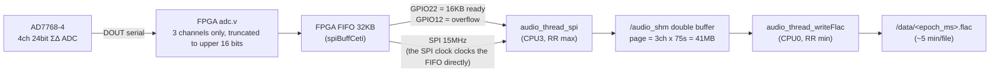

# 05. Sensors and Data Acquisition

## 1. Bus/pin maps

### I2C address map

| Device | Chip | Bus | Address |
|---|---|---|---|
| ECG ADC | TI ADS1219 | **0** | 0x44 (only device on bus 0) |
| I/O expander | PCAL6408/9538 family | 1 | 0x21 |
| Light | LiteON LTR-329ALS-01 | 1 | 0x29 |
| Battery gauge | Maxim MAX17320 | 1 | 0x36 (regs ≤0xFF) / 0x0B (>0xFF) |
| Pressure/temperature | Keller 4LD | 1 | 0x40 |
| RTC | (DS1307 class) | 1 | 0x68 |
| IMU | CEVA BNO086 | **bit-bang** GPIO23/24 @200 kHz | 0x4A |

### Key Raspberry Pi GPIOs (BCM)

| Pin | Use |
|---|---|
| 4 | IMU reset (through the FPGA) |
| 5 | FPGA CAM reset |
| 6 | ECG ADC DRDY (passed through the FPGA) |
| 8/9/10/11 | SPI0 — audio stream (CE0/MISO/MOSI/SCLK) |
| 12 | Audio FIFO **overflow** latch (FPGA→Pi) |
| 14/15 | UART — recovery board |
| 16/18/19 | FPGA CAM control link (SCK/DOUT/DIN, bit-banged) |
| 20/21/25/26/27 | FPGA slave-serial config (DATA/CLK/INIT_B/PROG_B/DONE) |
| 22 | Audio **data available** (FIFO high-water mark) (FPGA→Pi) |
| 23/24 | IMU bit-bang I2C |

### I/O expander pins (0x21)

| Bit | Use |
|---|---|
| 0 | 5 V enable (audio front end) |
| 1 | Recovery board STM32 BOOT0 |
| 2 | 3V3 RF enable (recovery board power) |
| 4 | **Burnwire ON** |
| 6/7 | ECG leads-off detect N/P |

## 2. Audio pipeline (the highlight)

The heart of the system. Path: **AD7768-4 ADC → FPGA FIFO → SPI → shared memory → FLAC
file**.

- **FPGA (`FPGA_v2p1/rtl/`)**: `adc.v` strips the 8-bit header from the AD7768's 32-bit
  per-channel frames and drops the low 8 bits, serializing **channels 0–2 only as 16-bit**
  into the FIFO (channel 4 is deliberately discarded for bandwidth). The FIFO's read clock
  is **the Pi's SPI SCLK itself**, so there is no MOSI protocol — clocking is the read.
- **Flow control**: once 16 KB (high-water mark 512×32 B) accumulates, GPIO22 rises and
  the Pi `spiRead`s one 16 KB block (~28.4 ms per block at 96 kHz/16-bit). On FIFO
  overflow, GPIO12 latches and the Pi runs a recovery routine (`__handle_overflow`) that
  resets and restarts acquisition.
- **ADC configuration goes over the CAM link**: `cam.v` implements a bit-banged bridge
  with a fixed 8-byte frame `[0x02][opcode][arg1][arg0][pay1][pay0][cs][0x03]`, used for
  ADC register access, FIFO reset/start/stop, an I2C bridge, LED control, and the system
  power-down (writing the BMS register). There is also an FPGA version query (currently
  0x23.0x01).
- **Sample rates**: 48/96/192 kHz (+750 Hz low power) via ADC decimation/clock-divider
  recipes. Defaults: 96 kHz/16-bit/wideband. With `ENABLE_RUNTIME_AUDIO 0` the runtime
  also forces 96 kHz/16-bit.
- **FLAC writing**: when a page (~75 s) fills, it is fed wholesale to the libFLAC encoder.
  Files rotate about every 5 minutes (4 pages), named by recording start time
  `<epoch_ms>.flac`, 3 channels. Building with `ENABLE_AUDIO_FLAC 0` writes big-endian raw
  PCM (`.raw`) instead.
- **Memory cost**: ~82.4 MiB shared-memory double buffer + ~82.4 MiB static FLAC
  conversion buffer ≈ **165 MiB** — the reason first boot creates a 1 GB swapfile on a
  512 MB board.
- Overflow/write-timing events land in `/data/data_audio_status.csv`.

## 3. ECG (`sensors/ecg.c`, `ecg_helpers/`)

- **Chip**: ADS1219 24-bit ΣΔ ADC, I2C bus 0 (0x44), external Vref, gain 1, **1000 SPS**
  continuous conversion, single-ended ch0.
- The acquisition thread busy-polls DRDY (GPIO6) on CPU 2 (isolated core) **without
  sleeping** — comments explain that sleeping caused spectrogram artifacts, so burning
  ~85% of a core is a deliberate choice.
- **Leads-off detection**: not a dedicated chip — I/O expander pins 6/7, cached by a 1 ms
  background thread and attached to every sample.
- Robustness: 100 consecutive zeros (board likely unplugged), 100 ms sample timeout, and
  I2C errors set note flags and trigger a 1 s pause plus full ADC re-init.
- **Files**: `/data/data_ecg_NN.csv` (rotates at 1 GiB, ~6.5 h each). Columns:
  `Timestamp [us], RTC Count, Notes, Sample Index, ECG, Leads-Off-P, Leads-Off-N`

## 4. IMU (`sensors/imu.c`, `device/bno086.c`, `log/imu_log.c`)

- **Chip**: BNO086 (SHTP protocol), pigpio bit-banged I2C (GPIO23/24, 200 kHz, addr 0x4A).
  500 ms wait after reset (shorter makes the first feature report fail).
- Enabled reports: rotation vector (quaternion) at **20 Hz**, accel/gyro/magnetometer at
  **50 Hz**.
- The acquisition thread parses SHTP reports every 20 ms into a 2-page ring buffer
  (page = 2 s, 340 reports); the logging thread writes four CSVs once per second:
  `/data/data_imu_quat_NN.csv`, `_accel_`, `_gyro_`, `_mag_` (each rotating at 1 GiB).
- Values are logged as **raw Q-point integers** (quaternion is Q14), not scaled units.
  `Capture_Timestamp_us` is back-dated using the sensor's internal delay fields.
- Provides latest-quaternion→Euler APIs used by the state machine's attitude check (float
  detection).

## 5. Pressure / water temperature (`sensors/pressure_temperature.c`, `device/keller4ld.c`)

- Keller 4LD (200 bar range), I2C 0x40. Request (0xAC) → 8 ms wait → read 5 bytes.
- Conversions: `P[bar] = (200/32768)·(raw−16384)`, `T[°C] = ((raw>>4)−24)·0.05−50`
- **1 Hz** sampling with exponential backoff on failure.
  `/data/data_pressure_temperature.csv` (`Pressure [bar], Water Temperature [C]`).
- This feeds the state machine's dive/surface decisions.

## 6. Light (`sensors/light.c`, `device/ltr329als.c`)

- LTR-329ALS-01, I2C 0x29. Visible + IR channels, **1 Hz**.
- `/data/data_light.csv` (`Ambient Light: Visible, Ambient Light: IR`).
- Aids attachment/detachment and day/night inference. The measurement-rate register is
  left at its power-on default.

## 7. Battery / BMS (`battery.c`, `device/max17320.c`)

- MAX17320 2-cell gauge + protector. R_sense 10 mΩ, design capacity 5000 mAh.
- At **1 Hz** reads cell 1/2 voltage, current, cell 1/2 temperature, SoC, and
  STATUS/PROTALRT flags into `/data/data_battery.csv` (flags decoded to human-readable
  strings).
- Software protections: charge FET disabled outside the allowed charge-temperature range,
  discharge FET disabled above the discharge limit (latched; cleared via `battery reset`).
- Nonvolatile configuration has only **7 write cycles**, so boot only overlays shadow RAM;
  permanent programming is a manual script (`ipc/nvwrite.sh`). `battery verify` compares
  NV contents against the expected table.
- Tag sleep/wake: `ipc/tagSleep.sh` (FETs off), `ipc/tagWake.sh` (FETs on); full
  power-down is delegated to the FPGA (`powerdown` command — the FPGA turns off the BMS
  after the Pi halts).

## 8. Everything that lands in `/data`

| File | Contents | Cadence/rotation |
|---|---|---|
| `<epoch_ms>.flac` | 3-ch audio | ~5 min/file |
| `data_audio_status.csv` | audio overflow/write events | event |
| `data_ecg_NN.csv` | 1 kHz ECG + leads-off | 1 GiB rotation |
| `data_imu_{quat,accel,gyro,mag}_NN.csv` | raw IMU values | 1 GiB rotation |
| `data_pressure_temperature.csv` | pressure/temperature | 1 Hz |
| `data_light.csv` | light | 1 Hz |
| `data_battery.csv` | battery | 1 Hz |
| `data_gps.csv` | raw NMEA sentences | on receive |
| `data_state.csv` | state machine timeline | 1 Hz |
| `data_systemMonitor.csv` | CPU/RAM/disk/temperature | 10 s |
| `data_config_<ts>.txt` / `data_tag_info_<ts>.yaml` | deployment config/metadata snapshot | once, 60 s in |
| `burnwire_timeout_start_time_s.csv` | burnwire timeout start time (reboot resilience) | state events |
| `test_result_<ms>.txt` | cetiHWTest results | manual |
| `*.log`, `logs/` | rsyslog redirection | continuous |

When free space drops below 1 GB the state machine moves to LOW_POWER_BURN and stops
recording.
