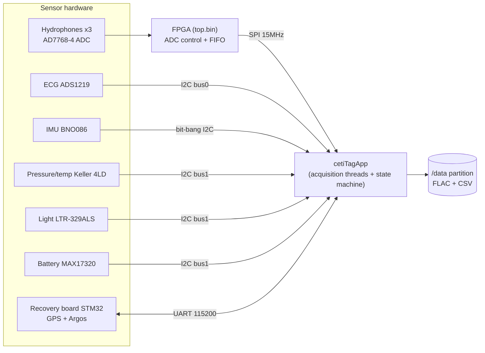

# Whale Tag Embedded — Reverse-Engineering Documentation (English)

This directory is the English edition of the reverse-engineering documentation for the
`whale-tag-embedded` repository. It is written so that a developer new to the code can
understand what the system is, how it is built, and what happens at runtime.
(한국어 버전은 [`docs/kr/`](../kr/README.md)에 있습니다.)

Analysis baseline: `main` branch commit `1e3507a` (v2.5 merge, January 2026), application
version `"State Machine Simplified - V2.5.1"`
(`packages/ceti-tag-data-capture/src/cetiTagApp/_versioning.h`).

## Table of contents

| Document | Contents |
|---|---|
| [01-overview.md](01-overview.md) | Project introduction, hardware generations, repository layout |
| [02-build-and-image.md](02-build-and-image.md) | Docker/QEMU SD-card image build pipeline, OS customization, Debian packaging, systemd service |
| [03-app-architecture.md](03-app-architecture.md) | Main application (`cetiTagApp`) — thread model, shared memory, command IPC, configuration |
| [04-state-machine.md](04-state-machine.md) | Mission state machine — states, transition conditions, thresholds, burnwire release logic |
| [05-sensors-and-audio.md](05-sensors-and-audio.md) | Sensors and data acquisition — FPGA audio pipeline, ECG, IMU, pressure, light, battery, pin/bus maps, `/data` outputs |
| [06-recovery.md](06-recovery.md) | Recovery board — GPS/Argos/APRS protocols, per-state power control, LED indications |
| [07-testing-and-known-issues.md](07-testing-and-known-issues.md) | Test infrastructure, hardware test, and the verified list of bugs found during analysis (with fix status) |

## 30-second summary

This repository contains the **complete embedded software for the data-collection tag
("Whale Tag")** that [Project CETI](https://www.projectceti.org/) (a sperm whale
communication research project) attaches to whales. Concretely:

1. A build system that reproducibly builds the **Raspberry Pi OS SD-card image** for the
   **Raspberry Pi Zero 2 W**-based tag using Docker + QEMU (`Makefile`, `build/`, `overlay/`)
2. The tag's core daemon **`cetiTagApp`** — a C program that simultaneously records
   3-channel hydrophone audio, ECG, IMU, pressure/temperature, light, and battery data to
   the `/data` partition, and autonomously drives the dive/surface/release/retrieve life
   cycle with a **mission state machine** (`packages/ceti-tag-data-capture/`)
3. The **FPGA gateware** (Verilog, `FPGA_v2p1/`) that drives the audio ADC (AD7768-4) and
   streams to the Pi over SPI, plus the Pi-side driver for the **STM32 recovery board**
   (GPS + Argos satellite / APRS VHF) that makes a detached tag findable

The tag records data for several days after attachment; on conditions such as a configured
timeout, low battery voltage, or low disk space it **heats a burnwire to corrode and cut
the attachment**, detaches itself from the whale, then transmits its GPS position via
satellite while waiting to be recovered.

## Data flow at a glance

## Suggested reading order

- For the whole picture → 01 → 03 → 04.
- To build/install the image → 02.
- For a particular sensor's data format → 05.
- From a deployment-operations point of view → 04 (release conditions) + 06 (recovery).
- Before modifying code → read 07 (known issues) first.
